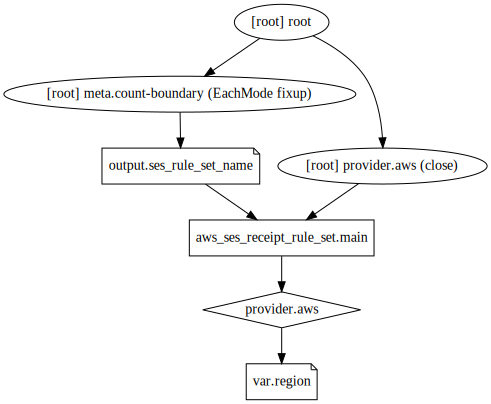

# Root account

## Graph

## Requirements

No requirements.

## Providers

| Name | Version |
|------|---------|
| aws | n/a |

## Inputs

| Name | Description | Type | Default | Required |
|------|-------------|------|---------|:--------:|
| log\_bucket\_name | n/a | `string` | `"rockygray-s3-logs"` | no |
| region | n/a | `string` | `"us-east-1"` | no |

## Outputs

| Name | Description |
|------|-------------|
| log\_bucket | n/a |
| ses\_rule\_set\_name | The name of the SES rule set |
