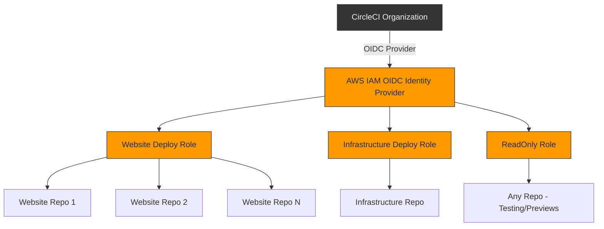
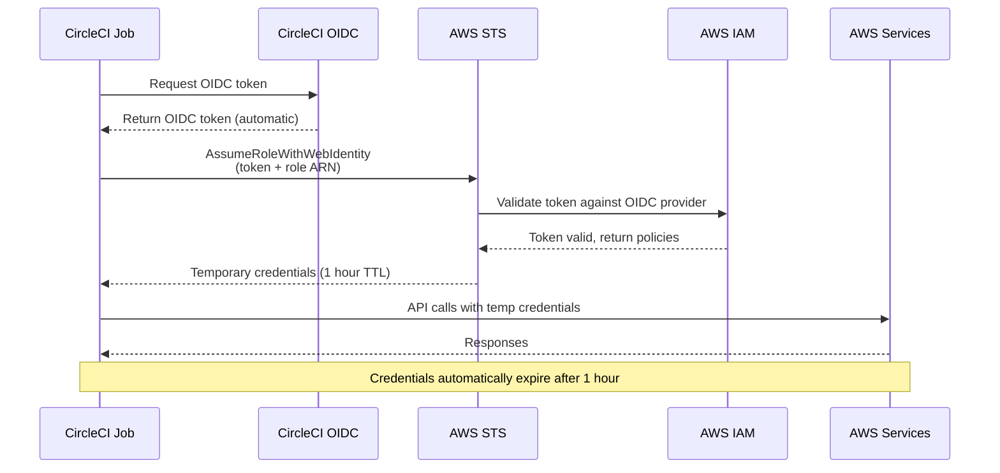

# CircleCI OIDC Authentication with AWS

## Overview

This document outlines the plan to set up OpenID Connect (OIDC) authentication to allow CircleCI to assume AWS IAM roles without storing long-lived credentials. This uses short-lived tokens that are automatically rotated, providing enhanced security for deployments.

The infrastructure is designed for a multi-repository architecture where global infrastructure is managed in this repository, and individual websites will be moved to their own repositories.

## Architecture

### Single OIDC Provider, Multiple Repositories



### Authentication Flow



## Directory Structure (Global Infrastructure Repo)

```
infrastructure/
├── circleci-oidc/
│   ├── backend.tf           # S3 backend configuration
│   ├── main.tf              # Provider configuration
│   ├── oidc-provider.tf     # OIDC identity provider
│   ├── iam-roles.tf         # IAM roles for different deployment scenarios
│   ├── iam-policies.tf      # IAM policies for deployment permissions
│   ├── variables.tf         # Input variables
│   ├── outputs.tf           # Output values (role ARNs, etc.)
│   └── README.md            # Documentation for using roles in CircleCI
```

## Resources to Create

### 1. OIDC Identity Provider (`oidc-provider.tf`)

**Purpose**: Establishes trust between CircleCI and AWS

**Configuration**:
- Provider URL: `https://oidc.circleci.com/org/<ORGANIZATION_ID>`
- Client ID list (audience): CircleCI organization ID
- Thumbprint: Retrieved automatically using `tls_certificate` data source
- Single provider shared across all projects

**Implementation Note**: Use Terraform's `tls_certificate` data source to automatically fetch the thumbprint:

```hcl
data "tls_certificate" "circleci" {
  url = "https://oidc.circleci.com/org/${var.circleci_organization_id}"
}

resource "aws_iam_openid_connect_provider" "circleci" {
  url             = "https://oidc.circleci.com/org/${var.circleci_organization_id}"
  client_id_list  = [var.circleci_organization_id]
  thumbprint_list = [data.tls_certificate.circleci.certificates[0].sha1_fingerprint]
}
```

### 2. IAM Roles (`iam-roles.tf`)

Multiple deployment roles with different permission levels:

#### Website Deployment Role: `circleci-website-s3-deploy-role`

**Purpose**: Deploy static websites to S3 and invalidate CloudFront caches

**Permissions**:
- S3 write access to website buckets
- CloudFront invalidation permissions

**Trust Policy**: Organization-scoped (any project in org can use)

#### Infrastructure Deployment Role: `circleci-infrastructure-deploy-role`

**Purpose**: Deploy Terraform infrastructure changes

**Permissions**:
- Full infrastructure management permissions
- S3 state bucket access
- DynamoDB state locking

**Trust Policy**: Organization-scoped + branch restriction (main only)

#### Read-Only Role: `circleci-readonly-role`

**Purpose**: For previews, testing, and non-destructive operations

**Permissions**:
- Read-only access to resources

**Trust Policy**: Organization-scoped (any branch)

### Trust Policy Strategy

```hcl
# Basic organization-level trust (flexible for multiple repos)
data "aws_iam_policy_document" "circleci_trust" {
  statement {
    actions = ["sts:AssumeRoleWithWebIdentity"]

    principals {
      type        = "Federated"
      identifiers = [aws_iam_openid_connect_provider.circleci.arn]
    }

    condition {
      test     = "StringEquals"
      variable = "oidc.circleci.com/org/${var.circleci_organization_id}:aud"
      values   = [var.circleci_organization_id]
    }
  }
}

# Optional: Add project-specific conditions
condition {
  test     = "StringLike"
  variable = "oidc.circleci.com/org/${var.circleci_organization_id}:sub"
  values   = ["org/${var.circleci_organization_id}/project/${var.project_id}/*"]
}

# Optional: Add branch restrictions
condition {
  test     = "StringLike"
  variable = "oidc.circleci.com/org/${var.circleci_organization_id}:sub"
  values   = ["*/main"]
}
```

### 3. IAM Policies (`iam-policies.tf`)

#### Website Deployment Policy

**Allows**:
- S3 object management (put, get, delete, list)
- CloudFront cache invalidation

**Scoped to**:
- Specific website buckets (www.rockygray.com, blog.rockygray.com, etc.)
- All CloudFront distributions (can be narrowed to specific distributions)

```json
{
  "Version": "2012-10-17",
  "Statement": [
    {
      "Effect": "Allow",
      "Action": [
        "s3:PutObject",
        "s3:PutObjectAcl",
        "s3:GetObject",
        "s3:DeleteObject",
        "s3:ListBucket"
      ],
      "Resource": [
        "arn:aws:s3:::www.rockygray.com/*",
        "arn:aws:s3:::www.rockygray.com",
        "arn:aws:s3:::blog.rockygray.com/*",
        "arn:aws:s3:::blog.rockygray.com"
      ]
    },
    {
      "Effect": "Allow",
      "Action": "cloudfront:CreateInvalidation",
      "Resource": "arn:aws:cloudfront::*:distribution/*"
    }
  ]
}
```

#### Infrastructure Deployment Policy

**Allows**:
- S3 state bucket access
- DynamoDB state locking
- IAM, CloudFront, S3, ACM, Route53 permissions (scoped appropriately)

**Best Practice**: Use least privilege principle - only grant permissions needed for the specific infrastructure being managed.

### 4. Variables (`variables.tf`)

```hcl
variable "circleci_organization_id" {
  description = "CircleCI Organization ID (found in CircleCI Org Settings → Overview)"
  type        = string
}

variable "website_buckets" {
  description = "List of S3 bucket names that CircleCI can deploy to"
  type        = list(string)
  default     = [
    "www.rockygray.com",
    "blog.rockygray.com",
    "www.ra-gray-realty.com",
    "www.onyxroseadvisors.com"
  ]
}

variable "region" {
  description = "AWS region"
  type        = string
  default     = "us-east-1"
}

variable "env" {
  description = "Environment tag"
  type        = string
  default     = "prod"
}
```

### 5. Outputs (`outputs.tf`)

```hcl
output "oidc_provider_arn" {
  description = "ARN of the CircleCI OIDC provider"
  value       = aws_iam_openid_connect_provider.circleci.arn
}

output "website_deploy_role_arn" {
  description = "ARN of the role for deploying websites (use in CircleCI)"
  value       = aws_iam_role.website_deploy.arn
}

output "infrastructure_deploy_role_arn" {
  description = "ARN of the role for deploying infrastructure (use in CircleCI)"
  value       = aws_iam_role.infrastructure_deploy.arn
}

output "readonly_role_arn" {
  description = "ARN of the read-only role (use for testing/previews)"
  value       = aws_iam_role.readonly.arn
}
```

## Implementation Steps

### Phase 1: Global Infrastructure Setup

#### Step 1: Gather Prerequisites

**CircleCI Organization ID**:
1. Log into CircleCI web console
2. Navigate to Organization Settings → Overview
3. Copy the Organization ID

**Resource Inventory**:
- List all S3 buckets that need deployment access
- List all CloudFront distributions for invalidation
- Identify any other AWS resources that need access

#### Step 2: Create Terraform Configuration

1. Create directory structure:
   ```bash
   mkdir -p infrastructure/circleci-oidc
   ```

2. Create the following files:
   - `backend.tf` - S3 backend configuration (following existing pattern)
   - `main.tf` - Provider configuration
   - `oidc-provider.tf` - OIDC identity provider
   - `iam-roles.tf` - IAM roles (website deploy, infrastructure deploy, readonly)
   - `iam-policies.tf` - IAM policies with least privilege
   - `variables.tf` - Input variables
   - `outputs.tf` - Output role ARNs
   - `README.md` - Usage documentation

#### Step 3: Deploy Infrastructure

```bash
cd infrastructure/circleci-oidc

# Initialize Terraform with S3 backend
terraform init

# Review the plan carefully (OIDC setup is security-critical)
terraform plan

# Apply the configuration
terraform apply

# Save the outputs (role ARNs) for CircleCI configuration
terraform output
```

**Important**: Save the role ARNs from the output - you'll need these for CircleCI context configuration.

### Phase 2: Update Website Repositories

For **each website repository** (www.rockygray.com, blog.rockygray.com, etc.), follow these steps:

#### Step 1: Update CircleCI Configuration

**Current Flow** (using stored credentials):
```yaml
- run:
    name: Deploy the app
    command: make publish  # Uses AWS_ACCESS_KEY_ID and AWS_SECRET_ACCESS_KEY
```

**New Flow** (using OIDC):

```yaml
version: 2.1

orbs:
  aws-cli: circleci/aws-cli@4.1.3

jobs:
  build:
    docker:
      - image: cimg/node:18.0
    steps:
      - checkout
      - restore_cache:
          key: v1-node_modules-{{ checksum "package-lock.json" }}
      - run:
          name: Install packages
          command: npm install
      - save_cache:
          key: v1-node_modules-{{ checksum "package-lock.json" }}
          paths:
            - node_modules
      - run:
          name: Build
          command: make build
      - persist_to_workspace:
          root: .
          paths:
            - build

  deploy:
    docker:
      - image: cimg/aws:2024.03
    steps:
      - attach_workspace:
          at: .

      # Authenticate using OIDC token
      - run:
          name: Authenticate with AWS using OIDC
          command: |
            # CircleCI provides OIDC token via environment
            echo "Assuming role: $AWS_ROLE_ARN"

            TEMP_CREDS=$(aws sts assume-role-with-web-identity \
              --role-arn "${AWS_ROLE_ARN}" \
              --role-session-name "circleci-${CIRCLE_PROJECT_REPONAME}-${CIRCLE_BUILD_NUM}" \
              --web-identity-token "${CIRCLE_OIDC_TOKEN}" \
              --duration-seconds 3600 \
              --output json)

            echo "export AWS_ACCESS_KEY_ID=$(echo $TEMP_CREDS | jq -r '.Credentials.AccessKeyId')" >> $BASH_ENV
            echo "export AWS_SECRET_ACCESS_KEY=$(echo $TEMP_CREDS | jq -r '.Credentials.SecretAccessKey')" >> $BASH_ENV
            echo "export AWS_SESSION_TOKEN=$(echo $TEMP_CREDS | jq -r '.Credentials.SessionToken')" >> $BASH_ENV

            source $BASH_ENV

      - run:
          name: Deploy to S3
          command: |
            aws s3 sync build/ s3://www.rockygray.com/ --delete

      - run:
          name: Invalidate CloudFront
          command: |
            aws cloudfront create-invalidation \
              --distribution-id ${CLOUDFRONT_DISTRIBUTION_ID} \
              --paths "/*"

workflows:
  version: 2
  build-deploy:
    jobs:
      - build
      - deploy:
          requires:
            - build
          context: website-deploy  # Context with OIDC variables
          filters:
            branches:
              only: main
```

#### Step 2: Configure CircleCI Context

**Create a Context in CircleCI**:
1. Navigate to CircleCI Organization Settings → Contexts
2. Click "Create Context"
3. Name: `website-deploy`

**Add Environment Variables**:
- `AWS_ROLE_ARN`: `arn:aws:iam::<ACCOUNT_ID>:role/circleci-website-s3-deploy-role`
  (Use the output from the Terraform apply in Phase 1)
- `AWS_DEFAULT_REGION`: `us-east-1`
- `CLOUDFRONT_DISTRIBUTION_ID`: (specific to each website)

**For infrastructure deployments**, create a separate context:
- Context Name: `infrastructure-deploy`
- Variables:
  - `AWS_ROLE_ARN`: `arn:aws:iam::<ACCOUNT_ID>:role/circleci-infrastructure-deploy-role`
  - `AWS_DEFAULT_REGION`: `us-east-1`

#### Step 3: Test and Validate

1. **Test on a feature branch first** (if readonly role is configured):
   - Create a test branch
   - Push changes
   - Verify CircleCI can authenticate with OIDC
   - Check that permissions work as expected

2. **Test deployment on main branch**:
   - Merge to main
   - Verify deployment succeeds
   - Check S3 objects were updated
   - Verify CloudFront invalidation occurred

3. **Validate security**:
   - Check AWS CloudTrail for OIDC authentication events
   - Verify temporary credentials are being used
   - Confirm credentials expire after 1 hour

4. **Remove old credentials**:
   - Once OIDC is working, remove stored AWS credentials from CircleCI project settings
   - Consider rotating the old access keys for security

### Migration Checklist (Per Website Repository)

- [ ] Update `.circleci/config.yml` to use OIDC authentication
- [ ] Create/update CircleCI context with role ARN
- [ ] Add CLOUDFRONT_DISTRIBUTION_ID to context
- [ ] Test deployment on a feature branch (if possible)
- [ ] Test deployment on main branch
- [ ] Verify permissions work correctly
- [ ] Check CloudTrail logs for OIDC authentication
- [ ] Remove stored AWS credentials from CircleCI project settings
- [ ] Rotate old AWS access keys (if previously used)
- [ ] Update repository README with new deployment process
- [ ] Document any deployment script changes needed

## Key Differences: Before vs After

### Before (Long-lived Credentials)

```
AWS_ACCESS_KEY_ID (stored in CircleCI)
AWS_SECRET_ACCESS_KEY (stored in CircleCI)
    ↓
Direct AWS API calls
```

**Security concerns**:
- Credentials stored in CircleCI (potential leak)
- No automatic rotation
- Hard to audit which job used credentials
- Credentials valid indefinitely

### After (OIDC)

```
CircleCI generates OIDC token (automatic)
    ↓
AWS STS assumes role with web identity
    ↓
Temporary credentials (1 hour TTL)
    ↓
AWS API calls
```

**Security benefits**:
- No long-lived credentials stored anywhere
- Automatic token generation and rotation
- CloudTrail logging shows which job assumed which role
- Credentials automatically expire
- Fine-grained control via IAM conditions

## Benefits of This Approach

1. **Enhanced Security**: No long-lived credentials stored in CircleCI or anywhere else
2. **Centralized Management**: All IAM configuration in global infrastructure repository
3. **Auditable**: CloudTrail shows which CircleCI job assumed which role and when
4. **Flexible**: Easy to add new websites/projects - just reference the existing role ARN
5. **Least Privilege**: Each role has only the minimal permissions required
6. **Automatic Rotation**: Credentials expire after 1 hour and are re-issued per job
7. **Cost Effective**: No additional AWS costs for OIDC authentication
8. **Compliance**: Meets security best practices for CI/CD authentication

## Rollback Strategy

If issues arise during migration:

1. **Old credentials can remain active** during OIDC rollout
2. **Rollback is simple**: Revert CircleCI config changes
3. **Test in isolation**: Migrate one repository at a time
4. **Gradual migration**: Keep old credentials active until all repositories are migrated
5. **Monitoring**: Watch CloudTrail and CircleCI logs during transition

## Troubleshooting

### Common Issues

**Issue**: "Not authorized to perform sts:AssumeRoleWithWebIdentity"

**Solution**: Check that:
- CircleCI Organization ID is correct in OIDC provider
- Trust policy includes correct organization ID
- Role ARN is correct in CircleCI context

**Issue**: "Access Denied" when deploying to S3

**Solution**: Check that:
- IAM policy includes the S3 bucket in Resource list
- Bucket name is correct (case-sensitive)
- Policy is attached to the role

**Issue**: "Web identity token is invalid"

**Solution**: Check that:
- OIDC provider thumbprint is current
- CircleCI OIDC token URL hasn't changed
- Token hasn't expired (shouldn't happen in normal flow)

### Debugging Tips

1. **Check CloudTrail**: Look for AssumeRoleWithWebIdentity events
2. **Test IAM policy**: Use AWS Policy Simulator
3. **Verify token**: Decode CIRCLE_OIDC_TOKEN with jwt.io (for debugging only)
4. **Check role assumption**: Run assume-role-with-web-identity manually with AWS CLI

## Additional Resources

- [CircleCI OIDC Documentation](https://circleci.com/docs/guides/permissions-authentication/openid-connect-tokens/)
- [AWS IAM OIDC Providers](https://docs.aws.amazon.com/IAM/latest/UserGuide/id_roles_providers_create_oidc.html)
- [AWS STS AssumeRoleWithWebIdentity](https://docs.aws.amazon.com/STS/latest/APIReference/API_AssumeRoleWithWebIdentity.html)
- [Terraform aws_iam_openid_connect_provider](https://registry.terraform.io/providers/hashicorp/aws/latest/docs/resources/iam_openid_connect_provider)

## Next Steps

1. Gather CircleCI Organization ID
2. Create Terraform configuration in `infrastructure/circleci-oidc/`
3. Deploy OIDC infrastructure
4. Test with one website repository
5. Migrate remaining repositories
6. Remove old credentials
7. Document learnings and update this guide as needed
