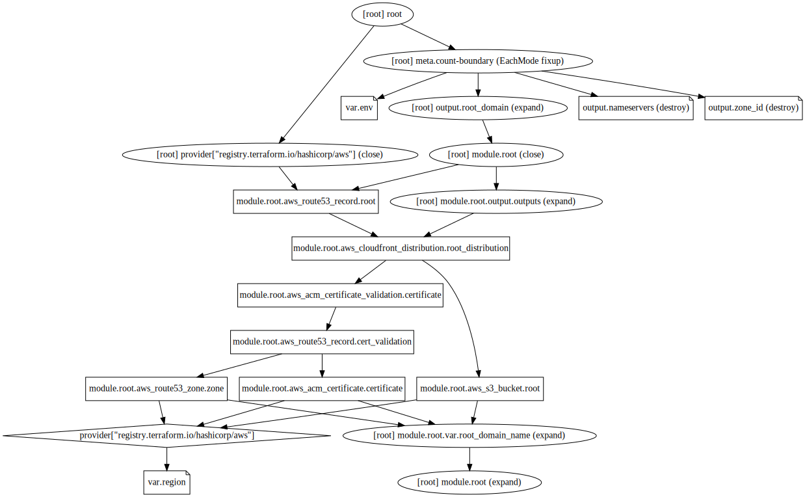

# grocky.com Infrastructure

This is the sets up the wild card certificate and apex domain for grocky.com

## Infrastructure Graph

## Requirements

No requirements.

## Providers

No provider.

## Inputs

| Name | Description | Type | Default | Required |
|------|-------------|------|---------|:--------:|
| env | n/a | `string` | `"prod"` | no |
| region | n/a | `string` | `"us-east-1"` | no |

## Outputs

| Name | Description |
|------|-------------|
| root\_domain | n/a |
