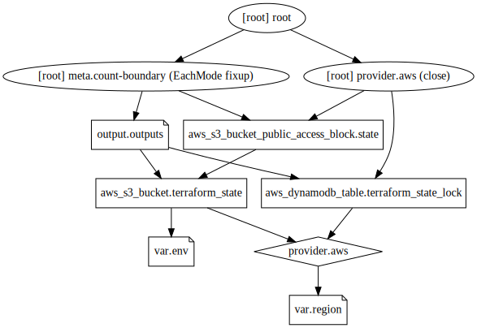

# Remote state infrastructure

Sets up the remote state bucket.

## Infrastructure Graph

## Requirements

No requirements.

## Providers

| Name | Version |
|------|---------|
|  [aws](#provider\_aws) | 4.32.0 |

## Modules

No modules.

## Resources

| Name | Type |
|------|------|
| [aws_dynamodb_table.terraform_state_lock](https://registry.terraform.io/providers/hashicorp/aws/latest/docs/resources/dynamodb_table) | resource |
| [aws_s3_bucket.terraform_state](https://registry.terraform.io/providers/hashicorp/aws/latest/docs/resources/s3_bucket) | resource |
| [aws_s3_bucket_public_access_block.state](https://registry.terraform.io/providers/hashicorp/aws/latest/docs/resources/s3_bucket_public_access_block) | resource |

## Inputs

| Name | Description | Type | Default | Required |
|------|-------------|------|---------|:--------:|
|  [env](#input\_env) | n/a | `string` | `"prod"` | no |
|  [region](#input\_region) | n/a | `string` | `"us-east-1"` | no |

## Outputs

| Name | Description |
|------|-------------|
|  [outputs](#output\_outputs) | n/a |
