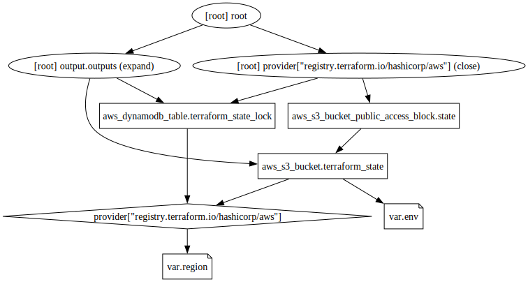

# Remote state infrastructure

Sets up the remote state bucket.

## Infrastructure Graph

## Requirements

No requirements.

## Providers

| Name | Version |
|------|---------|
| aws | n/a |

## Inputs

| Name | Description | Type | Default | Required |
|------|-------------|------|---------|:--------:|
| env | n/a | `string` | `"prod"` | no |
| region | n/a | `string` | `"us-east-1"` | no |

## Outputs

| Name | Description |
|------|-------------|
| outputs | n/a |

