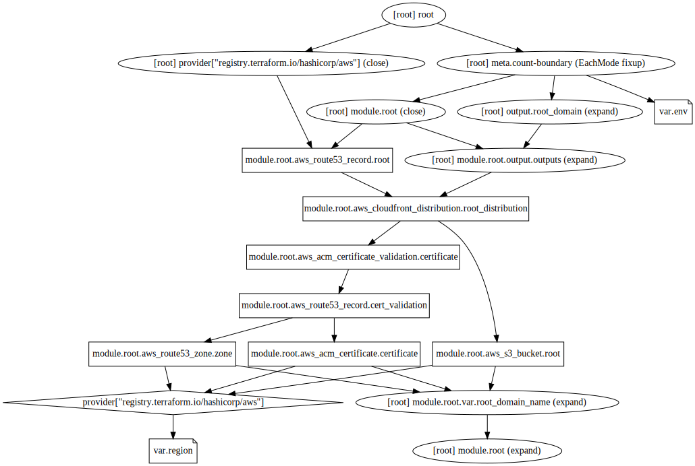

# rockygray.com Infrastructure

This sets up the wild card certificate and apex domain for rockygray.com

## Graph

## Requirements

No requirements.

## Providers

| Name | Version |
|------|---------|
| aws | n/a |

## Inputs

| Name | Description | Type | Default | Required |
|------|-------------|------|---------|:--------:|
| domain | n/a | `string` | `"rockygray.com"` | no |
| env | n/a | `string` | `"prod"` | no |
| region | n/a | `string` | `"us-east-1"` | no |

## Outputs

| Name | Description |
|------|-------------|
| certificate\_arn | n/a |
| cloudfront\_id | n/a |
| nameservers | n/a |
| root\_zone\_id | n/a |
