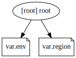

# grocky.com Infrastructure

This is the sets up the wild card certificate and apex domain for grocky.com

## Infrastructure Graph

## Requirements

No requirements.

## Providers

No providers.

## Modules

No modules.

## Resources

No resources.

## Inputs

| Name | Description | Type | Default | Required |
|------|-------------|------|---------|:--------:|
|  [env](#input\_env) | n/a | `string` | `"prod"` | no |
|  [region](#input\_region) | n/a | `string` | `"us-east-1"` | no |

## Outputs

No outputs.
