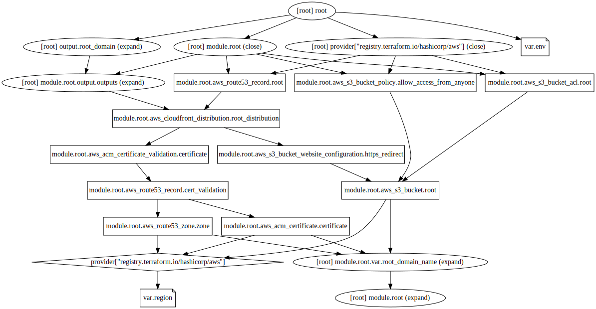

# rockygray.com Infrastructure

This is the sets up the wild card certificate and apex domain for rockygray.com

## Infrastructure Graph

## Requirements

No requirements.

## Providers

No providers.

## Modules

| Name | Source | Version |
|------|--------|---------|
|  [root](#module\_root) | ../../modules/root-domain | n/a |

## Resources

No resources.

## Inputs

| Name | Description | Type | Default | Required |
|------|-------------|------|---------|:--------:|
|  [env](#input\_env) | n/a | `string` | `"prod"` | no |
|  [region](#input\_region) | n/a | `string` | `"us-east-1"` | no |

## Outputs

| Name | Description |
|------|-------------|
|  [root\_domain](#output\_root\_domain) | n/a |
