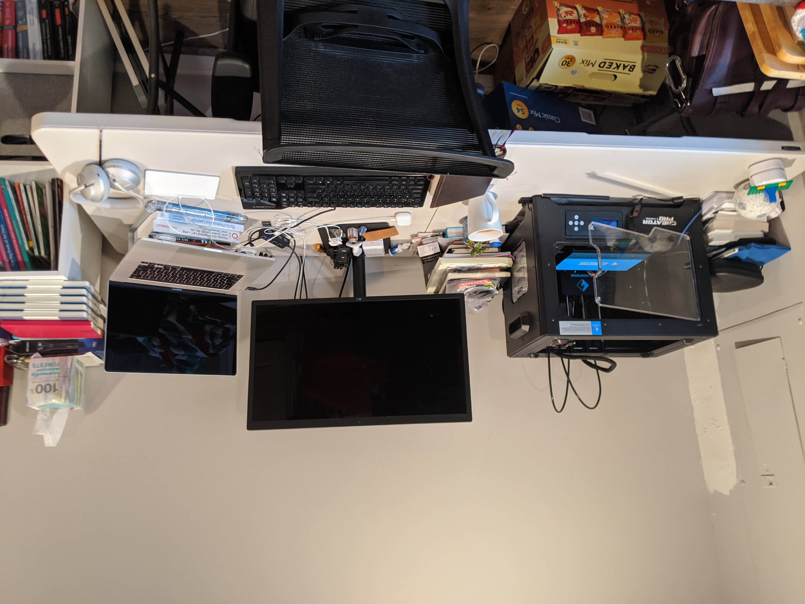

## A workable temporary solution

Like many others, when the pandemic started early this year I had to make due with what was available at home when we
had to work remotely. I was fortunate enough to have a plastic folding table that I could use for my work desk. It served
me well for over 6 months, but once I secured a permanent remote gig I figured it was time to get something more permanent.

During my [funemployment]( "my last days at Capital One") I decided to try my hand
at building a desk. I wanted something that would last for a _long_ time and something that I could customize. I originally
purchased a finished butcher block counter top from Home Depot, but it was damaged during delivery to the store
(pics of damage: [A](./damaged-1.jpg) [B](./damaged-2.jpg)). The only thing that was available in the store at Home Depot
and Lowe's were unfinished butcher block counter tops. Because I ended up buying the counter top from Lowe's because I was
frustrated with Home Depot. In the end I was able to take a plain, unfinished butcher block counter top and turn it into
a custom standing desk with my personal logo and built in wireless charger.



## The Process

The process actually started in the store. The only size available in the depth that I needed were `8ft` and `4ft`. The
nook in my basement could accommodate a `6ft` desk so I had the store rep cut the counter top down to size. I figured
this would be light work for the [big panel saw](https://www.lowes.com/pl/Panel-saws-Saws-Power-tools-Tools/878407644) they
had. Oh, boy, was I wrong. The saw damn near burned through its motor. I don't know if this was because the rep that was
making the cut was inexperienced or because it wasn't designed to cut thick cuts like butcher block (it's `1 3/4in` thick),
but I nearly went home with a half-way cut block of wood that probably wouldn't have been able to fit in my car. The
[videos I watched](https://www.youtube.com/results?search_query=cut+butcher+block+countertop) made it look so easy with their
circular saws! Next time I'll try and cut it down myself assuming I can fit the `8ft` long block in my car.

### Cleaning up the edges

Once I got my `6ft x 2ft` (and 2 `2ft x 12.5in` pieces for shelves) I was able to get to work finishing them. I used a
router with a round-over bit along all of the edges to soften them and clean up the edges that were touched by the saw.
This was my first time using a router, but it was really easy. I did experience some kickback when going through too much
material. I learned to respect the beast because when it violently kicks back things can go wrong quickly if you don't
hold on and control it. Once it was routed I used a hand sander to knock down the machining lines. In retrospect, I think
I set the depth of the router too low which caused a slight lip just above the curve of the round-over on the top face.

I basically did the same things for the shelves except I kept one edge flat so that it could sit flush against the wall
and I used a chamfer bit on the bottom edges to create an angled edge. Honestly, I like this look a lot and wish I had
done this for the desk top as well. Next time!



### Applying finish

For the finish I decided to go with Danish oil which is an oil and varnish combination. I wanted something that would
bring out the grain in the wood while keeping the wood feeling natural. It was really easy to apply. Just pour it on
spread it around and let it soak in. I ended up doing 3 coats in the first pass. I did this first few coats of finish
early on since they recommend sealing the butcher block within 48 hours of unwrapping it. I would end up doing a few more
coats of Danish oil and a top layer of [butcher block conditioner](https://www.lowes.com/pd/Howard-Butcher-Block-Conditioner-Clear-Butcher-Block-Oil-Actual-Net-Contents-12-oz/999918606)
to lock everything in once everything was finished.



### Base, wire management, and wireless charger

Once the first few coats of danish oil dried I started on assembling the base. I went with the [Jarvis Frame](https://www.fully.com/jarvis-frame-only.html)
as the base. This thing is solid. Each leg weighs at least 30 pounds and the dual motors can lift 350 pounds. The assembly
was really straight forward. I needed to center the legs and mark the holes myself. I awkwardly used a speed square to ensure
the placement of the marks were the same distance from the edges on each side of the table. With the holes marked I drilled
pilots for each, and attached the frame with the supplied wood screws.  Next I attached a [cable tray](https://www.amazon.com/dp/B07GLZZ2RZ) and a [super long surge protector](https://www.lowes.com/pd/PRIME-10-Outlet-1500-Joules-1875-Watt-AC/50213043)
I picked up separately to keep things nice and tidy underneath.

Then came the recess for the wireless charger. Definitely should have done this before attaching the frame and surge since
the dust went into every nook and cranny. I ended up just covering everything with a drop cloth to get the job done (and
subsequently picked up a shop vac and adapter to attach it to the router later on :sweat_smile:). I started off by marking
the center for the charger and traced the outline. I drilled a hole with a `1in` spade bit since I don't have a plunge
router making sure not to go too deep. Then I used a long straight router bit to cut the rest of the recess. I wanted to
leave about `1/8in` of material between the device and the wireless charger, so I marked `1/8in` on one of the shelves
and used that to adjust the depth of the router. I started out in the center, and spiraled out in a clockwise direction
until I reached the outline. Using this method took a long time. I think I will try to remove more material with the drill
first to make routing to the desired depth and edges much easier. Then I routed a short channel for the charger cable so
it wouldn't have to go through a really sharp angle.

I wanted to be able to swap out the charger easily if needed, so I needed a way to secure the charger without making it
using glue or something semi-permanent. I ended up routing 2 platforms on either side of the charger and cut a strip of
metal so I could screw the strip in place. It's not pretty, but it works! In retrospect, I should have just 3D printed
a strip of plastic, but I was browsing aisles in Lowe's and the long strips of metal caught my eye. Next time :smile:.



### Customize with personal logo

My cousin ([@mspizz92](https://twitter.com/mspizz92)) created a personal logo for me back in 2015. As a whole, it's a
capital letter `G`, and the segments can be arranged to make the rest of my initials (RGJ). I use it anywhere I can digitally,
but earlier this year I had a brand of the logo created. I have used it on some of my big leather pieces I use daily
(like my notebook cover, and work bag), and figured I could use it in this project as well. I needed to heat it up way
hotter than before to both create the burn marks and emboss it a bit on the wood. I used the center logo placement to mark the
area for the wireless charger and also branded the lower right of each piece for consistency. I'm not sure if it turns out better
before or after applying a finish, but I'm happy with the way it came out!



### Setup and placement

It was time to set everything up and move it from my garage into my "office" in the basement. This thing weighed at least
130 pounds. Because it was so awkward to carry, I needed a second pair of hands to get it through the door and carry it
in place. My gracious wife, [@AshleyAHGray](https://twitter.com/AshleyAHGray), helped me carry it in :sweat_smile:.

I attached my monitor mount and placed my 3D printer on top. I need to buy a VESA plate to actually attach my monitor to
the mount, but that's coming soon. I attached the Hue Play lights to the back of the monitor with the provided 3M adhesive.
I've got some simple automation for the lights to turn on and off during my working hours, but I plan to automate these
a bit more to be visual indicators for when I'm heads down.



In the end, I'm happy with the with the way this project came out. The desk is SOLID. I could probably twerk on it if I
needed to. I'm hoping it'll be the place I get work done for a very, very long time. When we move to a bigger place and
I have a dedicated spot for my 3D printer, I plan on moving the wireless charger so I can center myself, the monitors
and peripherals.

## Parts list

| Description             | Link                                                                                                                     |
| -----------             | --------                                                                                                                 |
| Jarvis wide frame only  | https://www.fully.com/jarvis-frame-only.html                                                                             |
| monitor mount           | https://www.amazon.com/dp/B07LFWPRG5                                                                                     |
| hue play                | https://www.amazon.com/gp/product/B07GXB3S7Z/                                                                            |
| floating shelf brackets | https://www.sheppardbrackets.com/https/shop-floating-shelf-brackets/heavy-duty-floatin-shelf-brackets-1-1/2inch-backplate-3/4-inch-rods |
| counter tops            | https://www.lowes.com/pd/The-Baltic-Butcher-Block-8-ft-Natural-Straight-Butcher-Block-Birch-Kitchen-Countertop/999931668 |
| leather desk top        | https://saddlebackleather.com                                                                                            |
| Surge protector         | https://www.lowes.com/pd/PRIME-10-Outlet-1500-Joules-1875-Watt-AC/50213043                                               |
| counter tops            | https://www.lowes.com/pd/The-Baltic-Butcher-Block-8-ft-Natural-Straight-Butcher-Block-Birch-Kitchen-Countertop/999931668 |
| wireless charger        | https://www.amazon.com/gp/product/B086XB2ZW2                                                                             |
| Cable Managemnt Tray    | https://www.amazon.com/dp/B07GLZZ2RZ                                                                                     |
