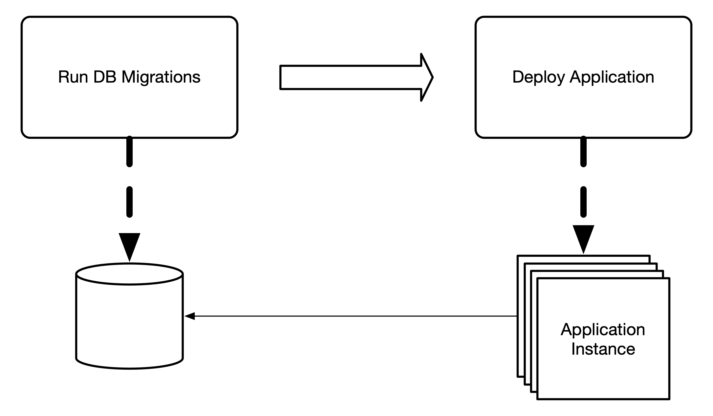
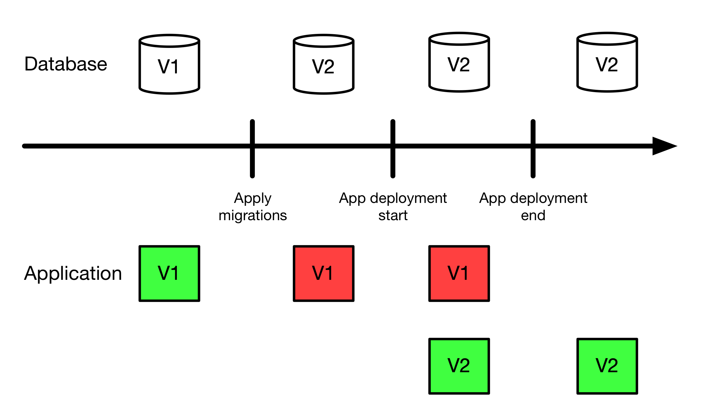
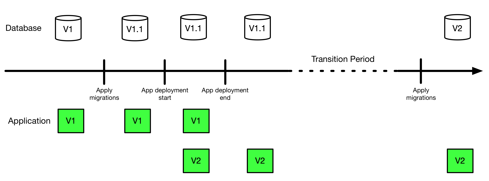

# Refactoring is good for your code and databases too!

Ever since reading [Refactoring](https://martinfowler.com/books/refactoring.html) by Martin Fowler I've gained a healthy amount of respect for the process and mechanics of refactoring code.
For the unaware, refactoring is a technique for restructuring an existing body of code without changing its behavior.
It identifies some common "code smells" and provides a step-by-step guide to refactoring the code into a better design.
Instead of plowing through and refactoring all the things at once and then playing whack-a-mole to get tests green again, following the principles described in the book allows you to be methodic and precise in the way you reshape your code.
It has certainly deepened my appreciation for the crafstmanship in writing code and reduced the chances that I get myself into a "Why is everything broken???" situation.

> [Storyblocks](https://www.storyblocks.com/)

Recently I have had to conduct a database change which moved some columns around to different tables and introduced a new schema structure.
Something I've done dozens of times before, though maybe a little brazenly.
Deploying database changes in my projects usually follow a run migrations then deploy the application pattern.
It is typically an explicit step within the deployment process and not tied to application startup to remove the chance of race conditions when there are multiple application instances.

This process works really well for getting database changes deployed.
However, when changing the database schema in a way that isn't backwords compatible (e.g. renaming, removing, or moving a column), then you risk some downtime or having some requests fail while the new version of your application is getting deployed.

I used to have the attitude that having failures during a deployment is acceptable.
We had 5% of requests fail for 5 minutes? Meh. As long as the new code is working as epxected we're good.
However, I knew there had to be a better way.
Especially since I'm interracting with some critical data and having a 1% request failure rate is a _really_ big deal.
I quickly found [Refactoring Databases](https://martinfowler.com/books/refactoringDatabases.html) by Scott Ambler and Pramod Sadalage and was delighted to see it had similar principles in breaking down data model refactors into safe, manageable pieces.

For the example of moving a column from one table to another, the key is to keep the schema backwards compatible to allow for a smooth transition between different versions of the application and allow for application rollbacks.
You can do this in a couple of phases where the new column location and updated application logic is grouped in one deployment and the removal of the old columns go out in a following deployment.
This prevents errors from schema misalignment while transitioning between application versions.

For destructive schema migrations (e.g. anything that would result in renaming or removing a column) the general proceedure is this:

1. Phase 1 - Deprecate Columns
    1. Write a migration to add columns (if necessary).
        1. When moving columns, you'll need to also move data over to the new column and set up triggers to synchronize data between the columns.
    1. Update the application to use the new column location (or stop using a column to be removed).
    1. Deploy.
1. Phase 2 - Transition
1. Phase 3 - Cleanup
    1. Write a migration that removes the previously used column.
    1. Deploy.

Thanks for reading!