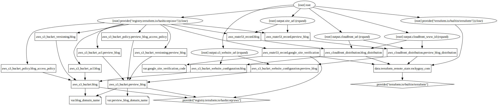

# Infrastructure

The infrastructure for [blog.rockygray.com](https://blog.rockygray.com)

## Graph

## Requirements

No requirements.

## Providers

| Name | Version |
|------|---------|
|  [aws](#provider\_aws) | 4.32.0 |
|  [terraform](#provider\_terraform) | n/a |

## Modules

No modules.

## Resources

| Name | Type | File |
|------|------|------|
| [aws_cloudfront_distribution.blog_distribution](https://registry.terraform.io/providers/hashicorp/aws/latest/docs/resources/cloudfront_distribution) | resource | (websites/blog.rockygray.com/infrastructure/cloudfront.tf#1) |
| [aws_cloudfront_distribution.preview_blog_distribution](https://registry.terraform.io/providers/hashicorp/aws/latest/docs/resources/cloudfront_distribution) | resource | (websites/blog.rockygray.com/infrastructure/cloudfront.tf#80) |
| [aws_route53_record.blog](https://registry.terraform.io/providers/hashicorp/aws/latest/docs/resources/route53_record) | resource | (websites/blog.rockygray.com/infrastructure/dns.tf#1) |
| [aws_route53_record.google_site_verification](https://registry.terraform.io/providers/hashicorp/aws/latest/docs/resources/route53_record) | resource | (websites/blog.rockygray.com/infrastructure/dns.tf#17) |
| [aws_route53_record.preview_blog](https://registry.terraform.io/providers/hashicorp/aws/latest/docs/resources/route53_record) | resource | (websites/blog.rockygray.com/infrastructure/dns.tf#25) |
| [aws_s3_bucket.blog](https://registry.terraform.io/providers/hashicorp/aws/latest/docs/resources/s3_bucket) | resource | (websites/blog.rockygray.com/infrastructure/s3.tf#1) |
| [aws_s3_bucket.preview_blog](https://registry.terraform.io/providers/hashicorp/aws/latest/docs/resources/s3_bucket) | resource | (websites/blog.rockygray.com/infrastructure/s3.tf#51) |
| [aws_s3_bucket_acl.blog](https://registry.terraform.io/providers/hashicorp/aws/latest/docs/resources/s3_bucket_acl) | resource | (websites/blog.rockygray.com/infrastructure/s3.tf#21) |
| [aws_s3_bucket_acl.preview_blog](https://registry.terraform.io/providers/hashicorp/aws/latest/docs/resources/s3_bucket_acl) | resource | (websites/blog.rockygray.com/infrastructure/s3.tf#71) |
| [aws_s3_bucket_policy.blog_access_policy](https://registry.terraform.io/providers/hashicorp/aws/latest/docs/resources/s3_bucket_policy) | resource | (websites/blog.rockygray.com/infrastructure/s3.tf#26) |
| [aws_s3_bucket_policy.preview_blog_access_policy](https://registry.terraform.io/providers/hashicorp/aws/latest/docs/resources/s3_bucket_policy) | resource | (websites/blog.rockygray.com/infrastructure/s3.tf#76) |
| [aws_s3_bucket_versioning.blog](https://registry.terraform.io/providers/hashicorp/aws/latest/docs/resources/s3_bucket_versioning) | resource | (websites/blog.rockygray.com/infrastructure/s3.tf#44) |
| [aws_s3_bucket_versioning.preview_blog](https://registry.terraform.io/providers/hashicorp/aws/latest/docs/resources/s3_bucket_versioning) | resource | (websites/blog.rockygray.com/infrastructure/s3.tf#94) |
| [aws_s3_bucket_website_configuration.blog](https://registry.terraform.io/providers/hashicorp/aws/latest/docs/resources/s3_bucket_website_configuration) | resource | (websites/blog.rockygray.com/infrastructure/s3.tf#11) |
| [aws_s3_bucket_website_configuration.preview_blog](https://registry.terraform.io/providers/hashicorp/aws/latest/docs/resources/s3_bucket_website_configuration) | resource | (websites/blog.rockygray.com/infrastructure/s3.tf#61) |
| [terraform_remote_state.rockygray_com](https://registry.terraform.io/providers/hashicorp/terraform/latest/docs/data-sources/remote_state) | data source | (websites/blog.rockygray.com/infrastructure/main.tf#15) |

## Inputs

| Name | Description | Type | Default | Required |
|------|-------------|------|---------|:--------:|
|  [blog\_domain\_name](#input\_blog\_domain\_name) | n/a | `string` | `"blog.rockygray.com"` | no |
|  [google\_site\_verification\_code](#input\_google\_site\_verification\_code) | n/a | `string` | `"google-site-verification=SwLro_FeJDDXllCq5zlf9VG-kfe1K_bK_bzdZW6YMxk"` | no |
|  [preview\_blog\_domain\_name](#input\_preview\_blog\_domain\_name) | n/a | `string` | `"preview-blog.rockygray.com"` | no |

## Outputs

| Name | Description |
|------|-------------|
|  [cloudfront\_url](#output\_cloudfront\_url) | n/a |
|  [cloudfront\_www\_id](#output\_cloudfront\_www\_id) | n/a |
|  [s3\_website\_url](#output\_s3\_website\_url) | n/a |
|  [site\_url](#output\_site\_url) | n/a |
