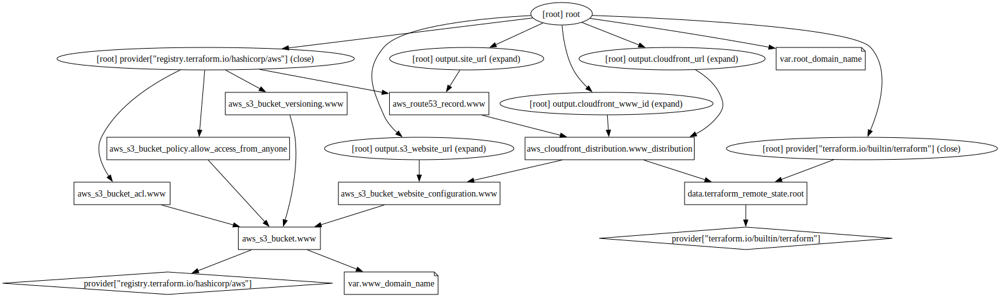

# Infrastructure

The infrastructure for [www.rockygray.com](https://www.rockygray.com)

## Graph

## Requirements

No requirements.

## Providers

| Name | Version |
|------|---------|
|  [aws](#provider\_aws) | 4.32.0 |
|  [terraform](#provider\_terraform) | n/a |

## Modules

No modules.

## Resources

| Name | Type |
|------|------|
| [aws_cloudfront_distribution.www_distribution](https://registry.terraform.io/providers/hashicorp/aws/latest/docs/resources/cloudfront_distribution) | resource |
| [aws_route53_record.www](https://registry.terraform.io/providers/hashicorp/aws/latest/docs/resources/route53_record) | resource |
| [aws_s3_bucket.www](https://registry.terraform.io/providers/hashicorp/aws/latest/docs/resources/s3_bucket) | resource |
| [aws_s3_bucket_acl.www](https://registry.terraform.io/providers/hashicorp/aws/latest/docs/resources/s3_bucket_acl) | resource |
| [aws_s3_bucket_policy.allow_access_from_anyone](https://registry.terraform.io/providers/hashicorp/aws/latest/docs/resources/s3_bucket_policy) | resource |
| [aws_s3_bucket_versioning.www](https://registry.terraform.io/providers/hashicorp/aws/latest/docs/resources/s3_bucket_versioning) | resource |
| [aws_s3_bucket_website_configuration.www](https://registry.terraform.io/providers/hashicorp/aws/latest/docs/resources/s3_bucket_website_configuration) | resource |
| [terraform_remote_state.root](https://registry.terraform.io/providers/hashicorp/terraform/latest/docs/data-sources/remote_state) | data source |

## Inputs

| Name | Description | Type | Default | Required |
|------|-------------|------|---------|:--------:|
|  [root\_domain\_name](#input\_root\_domain\_name) | n/a | `string` | `"rockygray.com"` | no |
|  [www\_domain\_name](#input\_www\_domain\_name) | n/a | `string` | `"www.rockygray.com"` | no |

## Outputs

| Name | Description |
|------|-------------|
|  [cloudfront\_url](#output\_cloudfront\_url) | n/a |
|  [cloudfront\_www\_id](#output\_cloudfront\_www\_id) | n/a |
|  [s3\_website\_url](#output\_s3\_website\_url) | n/a |
|  [site\_url](#output\_site\_url) | n/a |
